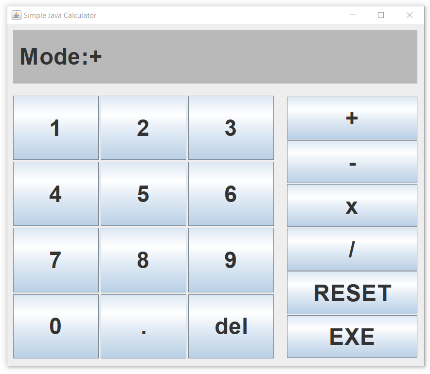
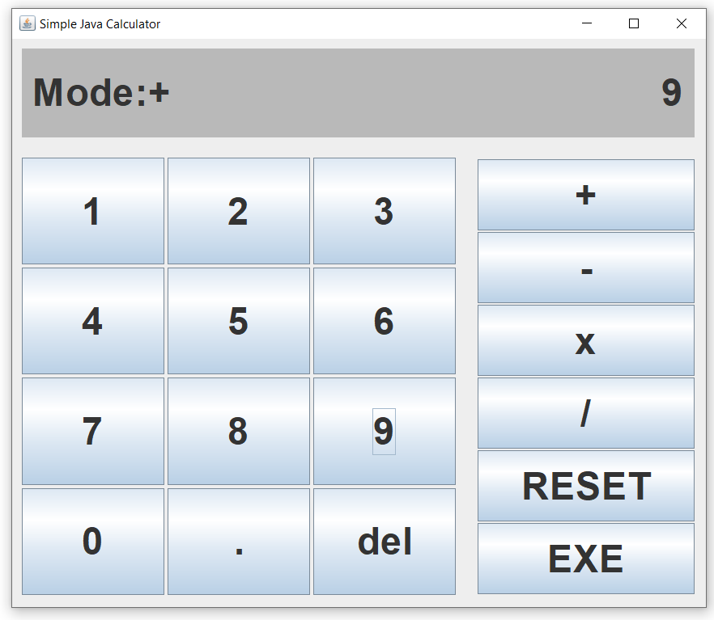
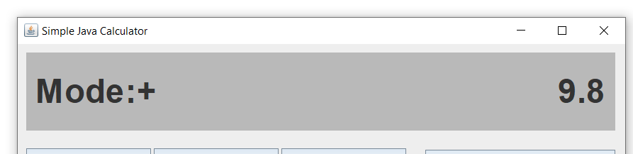
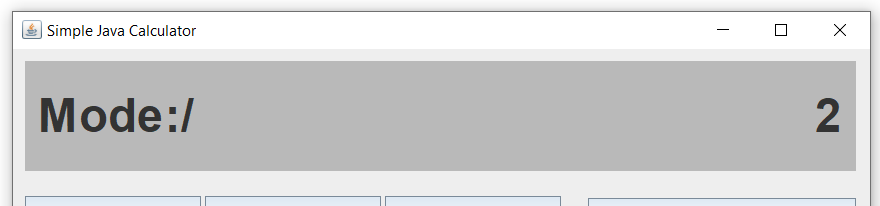
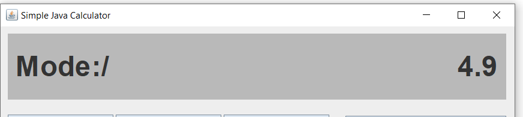
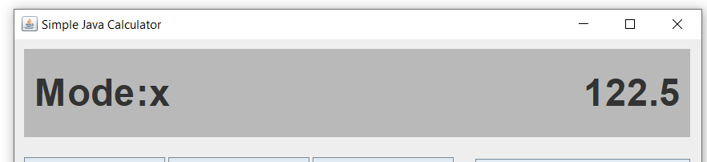

# Simple-java-calculator

## Index
### [About the program](#about)
### [System Requirement](#requirement)
### [License](#licen)

<h3 id="about"> About the program</h3>
This program is a simple java calculator that can do add, subtract, multiply and divide. Its GUI is in below picture:
  
The GUI supports auto-resize.  

To see what is the current operation mode, see the sign showed in "Mode:", "+" for add, "-" for subtract, "x" for multiply, "/" for divide.
  

To use it, click "Calculator.jar" to open it (Or compile it by yourself). It must first add a number, press the value and click "EXE" in + mode, which means 0 + value. 
In the below picture, 9 is added. Then, for each operation, choose the operator by pressing the respective button, the "Mode:" value will change to the respective 
operator, indicating successful operator change. If there isn't a new input of the operator, the least (default is +) will keep using, which can be used for a 
continuous operation like continuous adding. Then, input a new value as input(or left as is to use the answer) for calculation. To calculate, click "EXE", the answer 
will be shown and can be used directly for the next calculation.
  

In case of wrong input, click "del", then the input will become nothing again, reenter wanted value then. To start a new calculation, click "RESET", the calculator 
will be reset back to the initial status.  

Below is an example of an operation. Firstly, add 9.8:  "+" -> "9" -> "."-> "8"
  

Then, deivide by 2, press "/" -> "2":
  

Then click "EXE" to get answer = 4.9:
  

Then, times 5 for two times, press "x" -> "5" -> "EXE" ->"5" -> "EXE":
Result = 122.5:
   

This calculator can detect repeat dot input, which gives an error pop-up "dot already present". In the case of /0, it will give an error pop-up "cannot divide by 0". 
In the case of input end at ".", it will give an error pop-up "Invalid, input stopped at '.' ". If there is no value and "dot" was pressed, it will automatically add 0 
at the front, becoming "0.".

  
<h3 id="requirement"> System Requirement</h3>
Windows10 with Java installed, recommend Java 17 
Monitor with 700x600 or above

  
<h3 id="licen"> License</h3>
This program was released under no license by lrex93497
